# Prezentare proiect - Production Engineering : Safe Transfer

## Echipa
- Aelenei Alex
- Dima Florin-Alexandru
- Boca Bogdan

## Tema
Proiectul "Safe Transfer" este o aplicatie de banking securizata pentru gestionarea conturilor, transferuri intre conturi, monede si cursuri de schimb, completata de o platforma de CI/CD si observabilitate.

Obiectivul a fost sa construim un sistem care poate fi dezvoltat, testat, livrat si monitorizat in mod automat.

## MVP
Functionalitatile de baza livrate sunt:
- autentificare JWT
- creare si administrare conturi bancare
- transfer intre conturi
- gestionare monede
- gestionare cursuri de schimb
- testare automata pe mai multe nivele
- CI/CD folosind Jenkins
- monitorizare cu Prometheus, Grafana si AlertManager

## Design high level
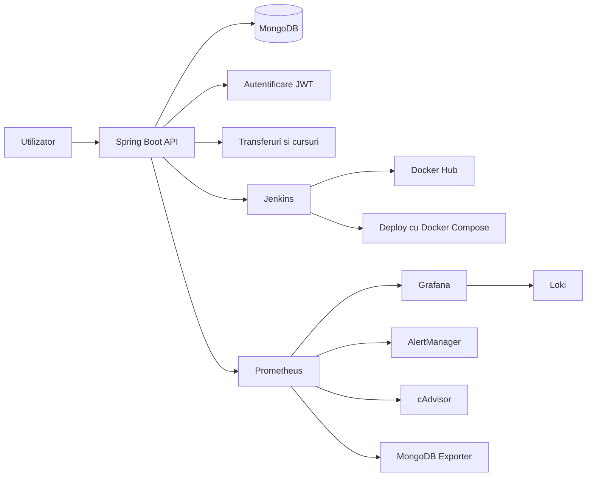

## Design low level
Aplicatia este organizata pe straturi clare:

- controller: primeste cereri HTTP si returneaza raspunsuri
- service: contine logica de business
- repository: acceseaza MongoDB
- model si response: defineste entitatile si DTO-urile
- security: JWT, filtre, autentificare si autorizare
- tests: unit, integration, e2e si performance

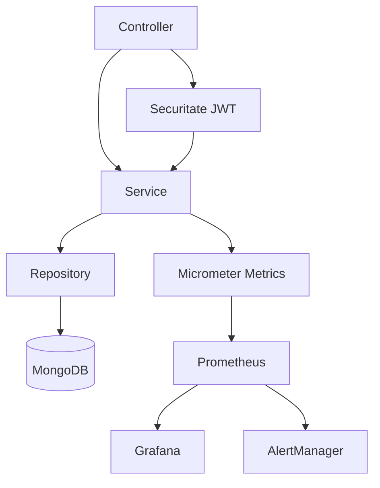

Exemplu de flux pentru endpoint-ul `GET /api/exchange-rates/rate`:

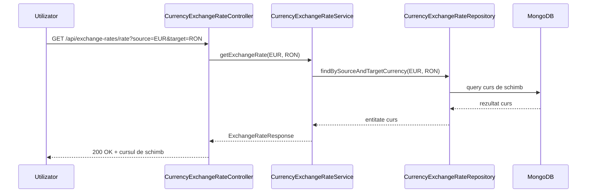

Exemplu de request valid:

```bash
GET /api/exchange-rates/rate?source=EUR&target=RON
Authorization: Bearer <jwt-token>
```

Exemplu de response valid:

```json
{
    "id": "66f1a2b3c4d5e6f789012345",
    "sourceCurrency": "EUR",
    "targetCurrency": "RON",
    "exchangeRate": 5.21
}
```

## Use case-uri de baza
### 1. Transfer intre conturi
- utilizatorul trimite suma dintr-un cont in altul
- sistemul valideaza soldul, moneda si conturile
- se salveaza tranzactii DEBIT si CREDIT

### 2. Gestionare monede si cursuri de schimb
- adaugare moneda
- setare curs de schimb
- calcul automat pentru cursul invers

### 3. Autentificare si securitate
- sign up si sign in cu JWT
- acces controlat la endpoint-uri protejate

### 4. Operare si livrare automata
- build si test in Jenkins
- publicare imagine Docker in Docker Hub
- deploy automat cu Docker Compose
- verificare prin teste de integrare

## Metrics
Am folosit Micrometer si endpoint-ul `/actuator/prometheus` pentru a expune metrici utile pentru aplicatie si infrastructura.

Metricile urmarite acopera:
- business: numar de operatii relevante pentru domeniu
- performance: durata cererilor HTTP
- error: rata erorilor si raspunsuri 5xx
- resource: memorie, CPU, conexiuni
- domain specific: metrici pentru operatii din banking si schimb valutar

Exemple de intrebari urmarite prin metrics:
- cate cereri primeste aplicatia in timp
- ce endpoint-uri sunt cele mai lente
- ce rata de erori are sistemul
- cum se comporta memoria si consumul de resurse

## Alerts
Alerting-ul a fost construit cu Prometheus si AlertManager. Am folosit MailTrap pentru a simula generarea de alerte pe email.

Tipuri de alerte:
- availability: serviciul nu mai raspunde
- performance: latenta prea mare
- quality: rata de erori prea mare
- infrastructura: container cazut sau indisponibil

Fluxul este:
- Prometheus evalueaza regulile
- alertele trec prin Inactive, Pending, Firing, Resolved
- AlertManager trimite notificari pe email
- putem aplica silences si grouping pentru a reduce zgomotul

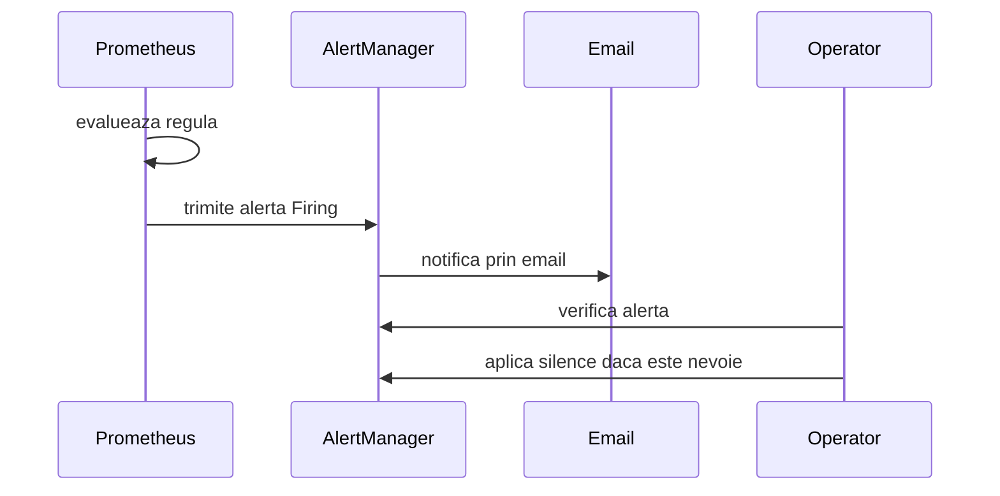

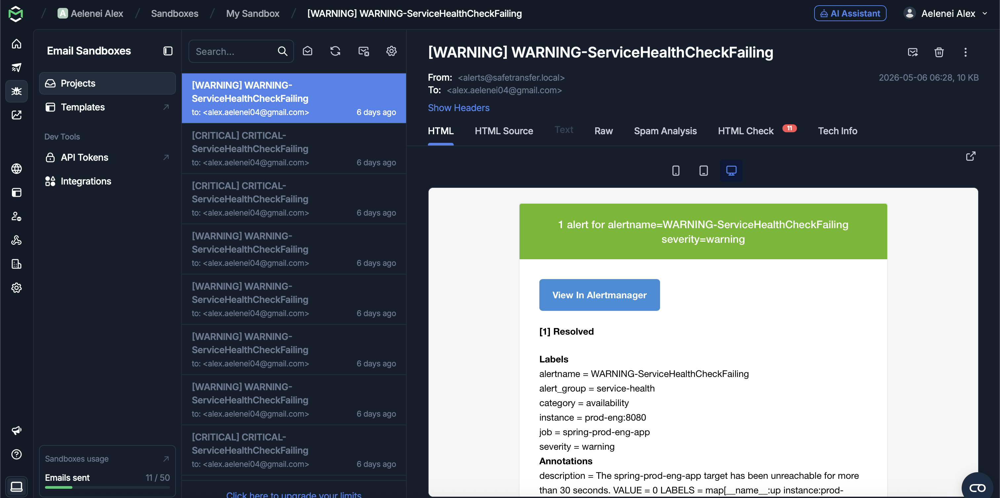

## Dashboards
Grafana a fost folosit pentru vizualizarea metricilor si pentru corelarea lor cu alertele.

Am urmarit:
- request rate pe endpoint
- p95 response time
- utilizare memorie
- rata de erori și numarul de erori dupa excepție
- starea containerelor si a MongoDB
- statusul și latența transferurilor

Dashboard-urile permit:
- analiza rapida a starii sistemului
- observarea tendintelor in timp
- corelarea alertelor cu valorile din grafice

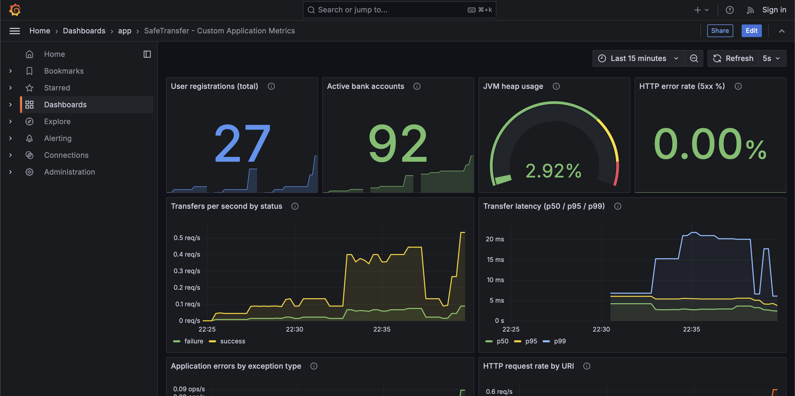
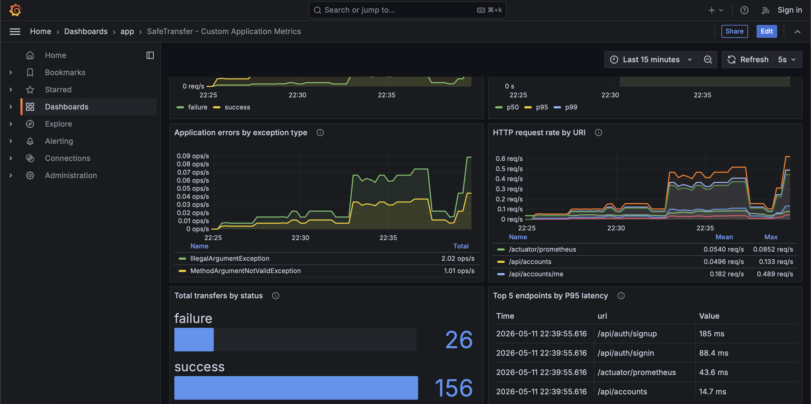

## Testare si calitate
Am acoperit mai multe niveluri de testare:
- unit tests pentru logica de business
- integration tests pentru verificarea persistentei reale
- e2e tests pentru scenarii complete prin API
- performance tests cu JMeter

Acest lucru a ajutat la validarea comportamentului aplicatiei inainte de deploy si in pipeline-ul de CI/CD.

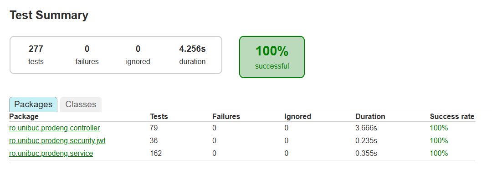
Unit Tests

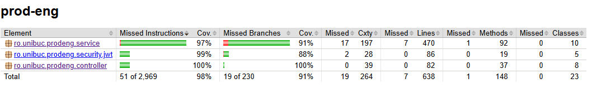
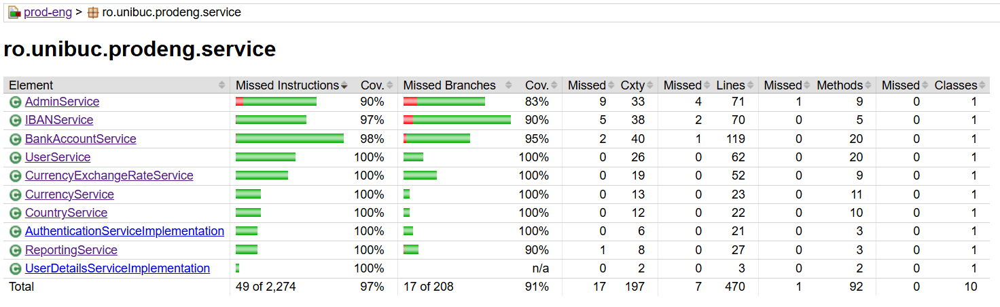
JaCoCo

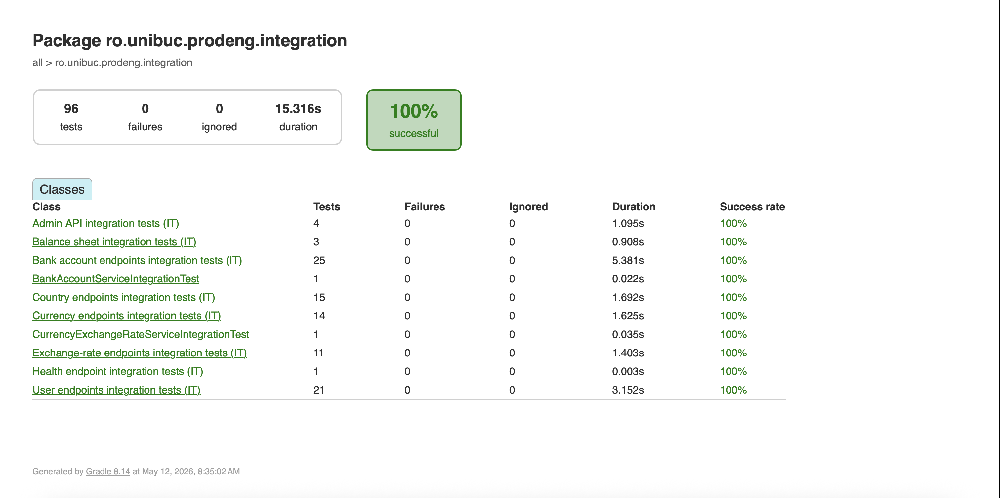
Integration Tests

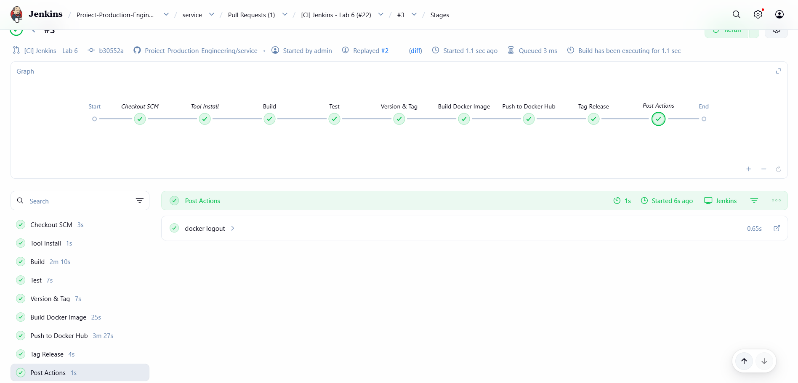
Jenkins

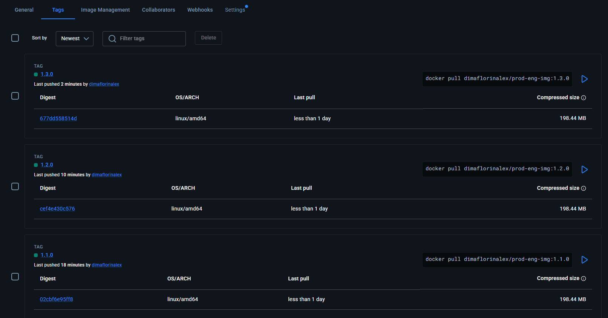
Docker Hub

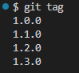
git tag

## Cum am folosit AI (GitHub Copilot, Claude)
AI a fost folosit ca asistenta pentru:
- structurarea documentatiei si a prezentarii
- clarificarea unor erori de configurare si testare
- organizarea fisierelor de test si a cailor corecte
- formularea unor sectiuni concise pentru README si documentatie
- scanarea statica a codului pentru cresterea calitatii acestuia
- procesul de code review

AI nu a inlocuit deciziile de proiectare. Deciziile finale despre cod, teste si comportamentul aplicatiei au fost validate manual de membrii echipei.

## Cum am lucrat in echipa
Am lucrat in mod incremental, pe branchuri specifice fiecarui feature si reunirea progresului in main, cu impartire pe zone clare:
- business logic si API
- teste unitare si de integrare
- CI/CD cu Jenkins
- monitoring si alerting

Am urmarit:
- pastrarea comunicarii constante in echipa
- verificarea si validarea schimbarilor prin teste automate si manuale
- evitarea duplicatelor si a configuratiilor inconsistente
- documentare clara pentru fiecare etapa importanta
- distribuirea uniforma a cunostintelor intre membrii echipei

## Concluzie
Proiectul acopera ciclul complet al unei aplicatii de productie:
- planificare
- analiza
- proiectare
- dezvoltare (implementare)
- testare
- integrare si livrare automata
- mentenanta (monitorizare, alertare)

Rezultatul este o aplicatie care respecta principii esentiale de implementare, operare si monitorizare in medii profesionale.